# ⚾ 장타를 맞은 투수는 그 구종을 피하는가

**MLB Statcast 2021–2026 투구 데이터로 본 장타 이후 구종 회피**

- 작성일: 2026-10-05
- 데이터: MLB 정규시즌 투구 3,592,302개 (2021 ~ 2026-07-12, 투수 1,067명)
- 분석 코드: `notebooks/03`~`07`, `src/analysis/` (재현 방법은 [부록 B](#부록-b-수치-기준과-재현))

---

## 요약

투수가 장타(2루타·3루타·홈런)를 맞은 뒤, 그 공의 구종을 이후에 덜 던지는지를 확인했습니다.

| 질문 | 답 | 핵심 수치 |
|---|---|---|
| 장타를 친 타자를 같은 경기에서 다시 만나면, 그 구종을 덜 던지는가? | **예** | 비슷한 상황의 아웃 뒤보다 **14.3%p** 덜 던짐. 다시 던질 오즈는 약 **0.29배** |
| 경기 상황(주자·아웃·이닝·카운트·점수차)을 맞춰도 남는가? | **예** | 시즌·구종계열만 맞췄을 때 14.4%p, 경기 상황까지 모두 맞췄을 때 14.3%p로 거의 같음 |
| 장타를 친 **그 타자**를 향한 회피인가? | **주로 그렇다** | 같은 장타 안에서, 그 사이 상대한 다른 타자들보다 그 타자에게 **9.5%p** 더 피함. 장타 전에는 오히려 그 구종을 더 던졌음 |
| 결과(장타) 때문인가, 잘 맞은 타구 때문인가? | **둘 다** | 잘 맞은 아웃도 피함(배럴 아웃은 비배럴 아웃보다 10.1%p 더 피함). 타구 질이 같아도 결과가 나쁠수록 더 피함. 홈런은 타구 질과 거의 무관 |
| 그날 그 구종이 안 좋아서 피한 것 아닌가? | **아니다** | 그날 구종 상태와 장타 맞은 공의 위치·구속까지 맞춰도 14.3%p가 13.6%p로 줄어드는 데 그침 |
| 그렇게 피한 것이 좋은 선택이었나? | **아직 모름** | 다음 단계 |

*이 보고서의 대표 수치는 **14.3%p**(재대결, 경기 상황을 모두 맞춘 M3, 시즌 구사율 기준)입니다. 다른 절의 숫자가 이와 조금 다르면, 그 절에서 이유를 밝혔습니다.*

**한 문장으로:** 투수는 장타를 맞은 구종을 **그 장타를 친 타자에게** 뚜렷하게 덜 던지고, 이 경향은 경기 상황이나 그날 구종 상태로 설명되지 않는 **장타라는 사건에 대한 반응**입니다.

---

## 1. 왜 이 분석을 하게 되었나

### 1-1. 출발점이 된 질문

야구 중계에서 "방금 슬라이더를 맞았으니 다음에는 안 던지겠죠"라는 말을 자주 듣습니다. 직관적으로는 그럴듯하지만, 실제로 투수가 그렇게 행동하는지, 그렇다면 얼마나 강하게 그러는지는 확인된 적이 거의 없습니다.

이 질문이 중요한 이유는 세 가지입니다.

1. **투수의 의사결정을 이해하는 문제입니다.** 투수가 한 번의 나쁜 결과에 반응해 계획을 바꾸는지 보여 줍니다.
2. **타자 쪽에서 예측할 수 있는 패턴입니다.** 장타를 친 타자가 다음 타석에서 그 구종이 덜 올 것을 안다면, 이를 이용할 수 있습니다.
3. **그 반응이 합리적인지 물을 수 있게 됩니다.** 한 번 맞은 공을 피하는 것은 정보에 근거한 조정일 수도, 결과에 대한 과잉반응일 수도 있습니다. 이 질문은 회피가 있다는 것이 먼저 확인되어야 시작할 수 있습니다.

### 1-2. 선행연구에서 비어 있던 곳

관련 연구는 세 갈래가 있지만, 이 질문을 직접 다룬 연구는 찾지 못했습니다([선행연구.md](../선행연구.md)).

| 갈래 | 대표 연구 | 다룬 것 | 비어 있던 것 |
|---|---|---|---|
| 직전 결과에 따른 선택 변화 | Gmeiner (2019) | 한 **타석 안**에서 직전 투구 결과에 따른 다음 투구 조정 | 타석과 타석 **사이**, 특히 장타 같은 큰 결과 이후 |
| 같은 경기 재대결 | Beyond the Box Score (2013), Roegele (2013) | 타순이 돌수록 배합이 바뀜 (결과와 무관한 평균 변화) | **결과에 따라** 배합이 어떻게 달라지는지 |
| 직전 선택 반복 회피 | Kovash & Levitt (2009) | 직전 공이 패스트볼이면 이번에도 패스트볼일 확률이 4.1%p 낮음 | 투구 단위가 아닌 **결과 조건부, 타자 단위** 회피 |

즉 "결과(장타)를 조건으로 → 타석 사이에서 → 같은 타자에게" 구종 사용이 바뀌는지는 비어 있었습니다. 동시에 선행연구는 **조심해야 할 점**도 알려 줍니다. 타순이 돌면 결과와 상관없이 배합이 바뀌고, 투수는 원래 직전 구종을 반복하지 않으려 합니다. 그래서 장타 뒤에 그 구종이 줄었다고 해서 바로 "장타 때문"이라고 할 수 없고, **장타가 아닌 경우와 비교하는 설계**가 필요했습니다.

### 1-3. 분석이 어떻게 이어졌나

이 프로젝트는 한 번에 설계된 것이 아니라, 앞 단계의 한계가 다음 단계의 질문이 되는 식으로 진행되었습니다.

| 단계 | 한 일 | 그래서 생긴 다음 질문 |
|---|---|---|
| ① 초기 분석 | 장타 뒤와 아웃·삼진·단타 뒤의 구종 비율을 그대로 비교 → 장타 뒤 13%p 낮음 | 비교 대상(대조군)이 장타와 성격이 너무 다르고, 투수가 원래 그 구종을 얼마나 던지는지를 빼지 않았다 ([부록 A](#부록-a-초기-분석과-시행착오)) |
| ② 대조군 다시 설계 | 대조군을 "타구가 나왔지만 아웃된 경우"로 바꾸고, 평소 구사율 대비 변화를 비교(차이의 차이) | 장타는 주자가 있는 위기 상황에서 더 자주 나온다. "장타라서"가 아니라 "위기라서" 피한 것 아닌가? |
| ③ 상황 통제 | 주자·아웃 → 이닝·카운트 → 점수차를 단계별로 맞춤(M0~M3) | 장타 직후 **다음 타자**에게도 피하는가? 두 분석이 섞여 보고된 적이 있어 분리가 필요 |
| ④ 다음 타자 분리 | 같은 방법을 다음 타자에게 따로 적용 | 투수는 장타라는 **결과**에 반응하는가, 잘 맞았다는 **타구 질**에 반응하는가? |
| ⑤ 타구 질 | 결과 × 타구 질(xwOBA, 배럴)로 나눠 비교 | 지금까지의 결론을 흔들 수 있는 약점은 없는가? (점검) |
| ⑥ 점검 | 그 타자를 향한 것인가 / 그날 구종이 나빴던 것 아닌가 / 신뢰구간은 맞는가 | 회피가 좋은 선택이었는가 (다음 단계) |

---

## 2. 데이터

| 항목 | 내용 |
|---|---|
| 출처 | MLB Statcast (Baseball Savant), 투구 단위 |
| 기간 | 2021 시즌 ~ 2026-07-12, 정규시즌만 |
| 표본 | 시즌 투구 수 500구 이상 투수(2026은 300구 이상)의 모든 투구 |
| 규모 | 투구 3,592,302개, 투수 1,067명 |
| 장타 | 70,319건 (2루타·3루타·홈런) |
| 주요 컬럼 | 구종(`pitch_type`), 타석 결과, 볼카운트, 주자, 아웃, 이닝, 점수, 타구 속도·각도, xwOBA, 구속, 투구 위치 |
| 없는 컬럼 | 투구별 Run Value, 포수, 타자별 스트라이크 존 높이 |

데이터는 팀이 공유한 고정 CSV 6개만 씁니다([data/raw/README.md](../data/raw/README.md)). Statcast는 구종 분류를 사후에 고치기 때문에, 다시 받으면 결과가 달라질 수 있어 새로 수집하지 않습니다.

---

## 3. 어떻게 측정했나

### 3-1. 기본 개념

| 용어 | 뜻 |
|---|---|
| **구종 T** | 장타(또는 대조군 아웃)가 나온 공의 구종. 예: 슬라이더를 맞아 2루타 → T = 슬라이더 |
| **재대결 (메인 분석)** | 같은 경기에서 장타를 친 타자가 다음에 타석에 섰을 때, 같은 투수가 다시 상대한 타석 |
| **다음 타자 (보조 분석)** | 장타 바로 다음 타석(항상 다른 타자) |
| **평소 구사율** | 그 투수가 T를 평소에 얼마나 던지는지. **시즌 구사율**(그 시즌 전체)과 **경기 내 구사율**(그 경기에서 장타 직전까지) 두 가지를 씁니다 |
| **감소** | 평소 구사율 − 비교 타석에서 T의 비율. 양수면 평소보다 덜 던졌다는 뜻입니다 |

### 3-2. 왜 대조군이 필요한가

장타 뒤 T의 비율이 줄었다고 해서 장타 때문이라고 할 수는 없습니다. 같은 경기에서 이미 던진 구종은 결과와 상관없이 다시 던지는 경향이 있고, 타순이 돌면 배합도 바뀝니다. 그래서 **장타 대신 아웃이 나온 경우**에 같은 계산을 해서 비교합니다.

- **대조군 = `field_out`:** 타구가 나왔지만 아웃된 타석입니다. 장타처럼 공이 맞았다는 점은 같고, 결과만 투수에게 좋았습니다. 삼진(2스트라이크 결정구라 성격이 다름)과 단타(그 자체로 나쁜 결과)는 넣지 않습니다.
- **순수 감소 = 장타군의 감소 − 대조군의 감소.** 결과와 상관없이 생기는 변화를 빼고 남는 "장타 때문인 몫"입니다(차이의 차이, diff-in-diff).

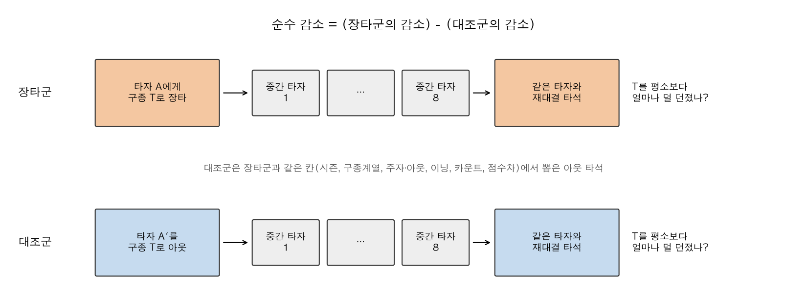

### 3-3. 상황 맞추기 (매칭 사다리 M0 → M3)

장타는 주자가 있는 위기 상황에서 더 자주 나옵니다. 위기에서는 원래 배합이 달라지므로, 대조군을 장타와 **같은 상황**에서 뽑아야 합니다. 맞추는 조건을 한 단계씩 늘려 결과가 변하는지 봅니다.

| 단계 | 대조군을 장타와 맞추는 조건 |
|---|---|
| M0 | 시즌 × 구종계열(패스트볼·브레이킹·오프스피드) |
| M1 | M0 + 주자 상황 × 아웃카운트 (24가지) |
| M2 | M1 + 이닝 구간(1–3, 4–6, 7+) + 볼카운트 구간(투수 유리, 동률, 타자 유리) |
| M3 | M2 + 점수차 구간(지는 중, 동점, 이기는 중) |

단계를 올려도 결과가 그대로면, 그 조건들이 결과를 만든 것이 아니라는 뜻입니다.

### 3-4. 통계 방법

- **순수 감소와 신뢰구간:** 칸(위 조건의 조합)마다 조건에 맞는 아웃을 전부 쓰고, 칸별 장타 수에 맞춰 가중합니다. 신뢰구간은 같은 투수의 이벤트끼리 비슷할 수 있다는 점을 반영해 **투수 단위로 복원 추출(부트스트랩, 1,000회)**해 계산합니다([4-9절](#4-9-신뢰구간을-제대로-냈나)).
- **혼합효과 로지스틱 회귀:** 비교 타석에서 T를 한 번이라도 던졌는지(0/1)를 장타 여부, 평소 구사율, 볼카운트, 아웃, 점수차, 타자 손, 구종계열, 시즌으로 설명하고, 투수마다 회피 정도가 다를 수 있게 했습니다(R `lme4`). **오즈비**가 1보다 작으면 장타 뒤 다시 던질 가능성이 낮다는 뜻입니다.

---

## 4. 결과

### 4-1. 장타를 맞은 구종을 그 타자에게 덜 던진다

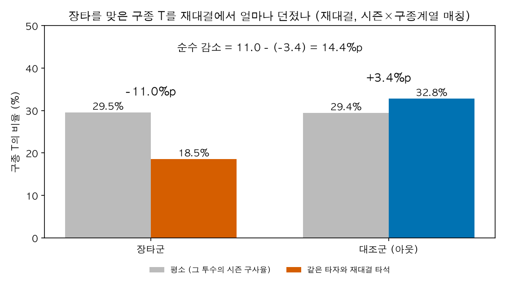

- 장타군은 평소 T를 29.5% 던지던 투수들인데, 재대결에서는 **18.5%**만 던졌습니다(−11.0%p).
- 대조군은 평소 29.4%에서 재대결 **32.8%**로 오히려 늘었습니다(+3.4%p). 같은 경기에서 이미 던진 구종을 다시 쓰는 일반적인 경향입니다. 삼진·볼넷이나 결과와 무관한 공을 기준으로 해도 비슷하게 늘어서, "아웃을 잡아서 신뢰가 생긴 것"이 아닙니다.
- 그래서 **순수 감소는 14.4%p**입니다. 평소 구사율의 거의 절반에 해당하는 크기입니다. (이 그림은 시즌과 구종계열만 맞춘 M0 기준입니다. 경기 상황까지 모두 맞추면 14.3%p이고, 이것이 이 보고서의 대표 수치입니다. 4-2절)
- 재대결에서 T를 한 번이라도 던진 비율은 장타군 45.7%, 대조군 67.7%입니다. 혼합모델의 오즈비는 **0.29** [0.27, 0.31]로, 장타를 맞은 뒤 T를 다시 던질 오즈가 대조군의 약 30%입니다.
- 평소 그 구종에 많이 의존하는 투수일수록 덜 피합니다(구사율과의 상호작용 오즈비 약 2.0). 대체할 구종이 마땅치 않으면 피하기 어렵다는 해석과 맞습니다.

### 4-2. 경기 상황을 맞춰도 그대로 남는다

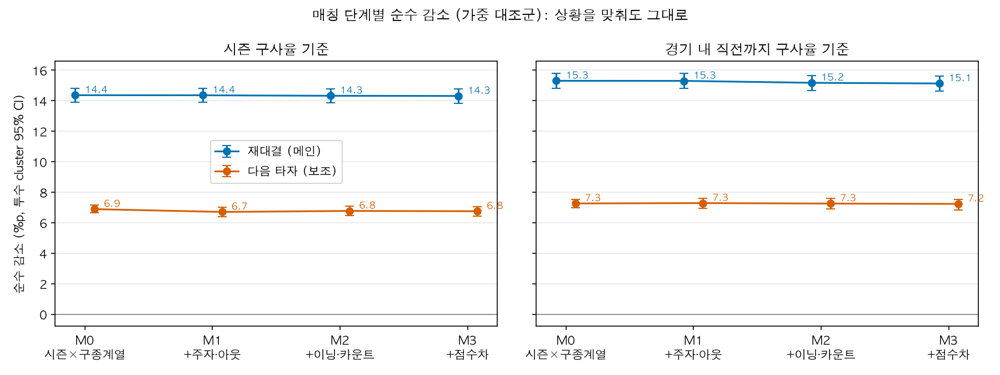

*그림과 표 모두 가중 대조군 + 투수 cluster 95% 신뢰구간 기준입니다(3-4절).*

| 단계 | 재대결 순수 감소 (시즌 기준) | 재대결 (경기 내 기준) | group 오즈비 | 장타 유지율 |
|---|---:|---:|---:|---:|
| M0 시즌×구종계열 | 14.36%p [13.90, 14.81] | 15.30%p | 0.30 [0.28, 0.33] | 100% |
| M1 + 주자·아웃 | 14.36%p [13.89, 14.80] | 15.30%p | 0.28 [0.26, 0.30] | 100% |
| M2 + 이닝·카운트 | 14.32%p [13.86, 14.79] | 15.17%p | 0.29 [0.27, 0.32] | 100% |
| **M3 + 점수차** | **14.31%p [13.83, 14.76]** | **15.13%p** [14.63, 15.62] | **0.29** [0.27, 0.31] | 98% |

*순수 감소는 가중 대조군 값이고, 오즈비는 혼합모델을 대조군 1:1 표본에 맞춘 값입니다(가중 방식으로는 모델을 적합하지 않았습니다). 1:1 표본을 다시 뽑으면 오즈비가 ±0.01 정도 움직입니다(4-9절).*

- **우려는 실제로 있었습니다.** M0에서 장타는 대조군보다 주자가 있을 때 더 자주 나왔습니다(주자 수 SMD 0.12). 매칭하면 이 차이가 0이 됩니다.
- **그런데 결과는 거의 변하지 않습니다.** 네 단계의 차이가 모두 신뢰구간 안입니다. 상황이 회피를 만든 것이 아닙니다.
- **위기 상황별로 나눠도 같습니다(M3).** 주자 없음 14.3, 1루만 13.6, 득점권 15.4%p / 지는 중 14.5, 동점 13.8, 이기는 중 15.2%p로 모두 비슷합니다.

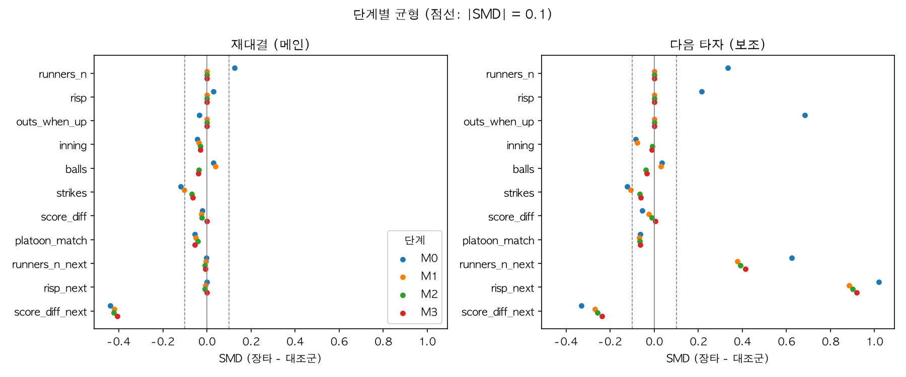

*SMD(표준화 평균차)가 0에 가까울수록 두 집단이 비슷합니다. 점선(±0.1) 안이면 균형으로 봅니다. 재대결 시점 점수차(`score_diff_next`)만 차이가 남는데, 장타가 점수를 바꾸는 사건이라 생기는 당연한 차이입니다.*

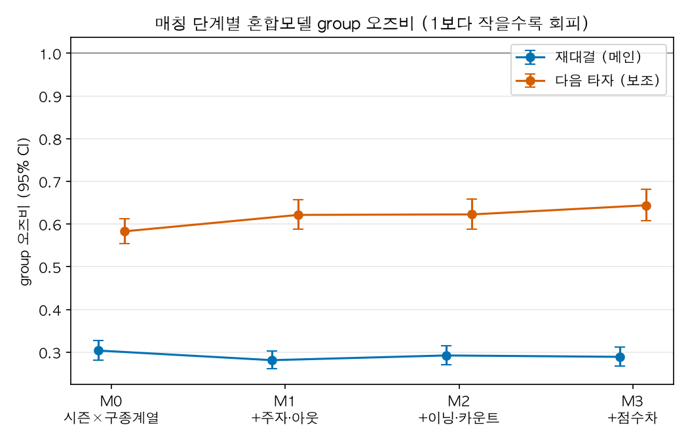

### 4-3. 구종·시즌·좌우를 나눠 봐도 같다

이 절은 상황 매칭 전(M0, 2026-09-25 분석)의 결과입니다. 원본 데이터 파이프라인 기준이라 위 수치와 소수점 단위로 조금 다릅니다([분석결과_상세.md](분석결과_상세.md)). 지표가 세 종류라 나눠 적습니다.

**순수 감소 (대조군을 뺀 값, 4-2절과 같은 지표)**

- **구종계열:** 패스트볼 13.8%p, 브레이킹 15.6%p, 오프스피드 16.4%p
- **같은 투수끼리 비교:** 대조군을 같은 투수·시즌·구종계열의 아웃으로만 뽑아도 14.3%p로 같음

**오즈비 (혼합모델, 1보다 작을수록 회피)**

- **구종별(9개):** 모든 구종에서 회피(0.22~0.47). 포심이 가장 약하고(0.47), 커브·체인지업·커터·슬라이더가 가장 강함(0.22~0.27). 구종 간 차이는 통계적으로 유의함
- **좌우:** 투수와 타자 손이 같을 때와 다를 때 회피 크기에 차이가 없음(상호작용 오즈비 0.98, p = 0.63)

**장타군만의 변화 (대조군을 빼지 않은 값)**

- **시즌별:** 2021~2026 여섯 시즌 모두 장타 뒤 그 구종의 비율이 평소보다 10.5~11.3%p 낮음. 대조군을 빼지 않은 값이라 순수 감소(약 14%p)보다 작지만, 시즌마다 거의 같다는 점을 보여 줍니다

### 4-4. 바로 다음 타자에게도 피하지만, 절반 이하다

같은 방법을 장타 바로 다음 타석(다른 타자)에 적용했습니다.

| | 재대결 (메인) | 다음 타자 (보조) |
|---|---:|---:|
| 순수 감소 (M3) | 14.31%p | **6.75%p** [6.43, 7.05] |
| group 오즈비 (M3) | 0.29 | **0.64** [0.61, 0.68] |

다음 타자 분석은 해석에 두 가지 주의가 필요해서 보조로 둡니다.

- **2아웃 장타가 빠집니다.** 2아웃에서 나온 아웃은 이닝을 끝내므로 "다음 타석"이 없고, 그래서 2아웃 장타(약 30%)는 비교할 대조군이 없습니다. 이 결과는 0·1아웃 장타에 해당합니다.
- **다음 타석의 상황이 다릅니다.** 장타 직후 다음 타자는 득점권에 주자가 있는 경우가 훨씬 많습니다(SMD 0.92). 이것은 장타의 결과라 맞출 수 없는데, 투수는 득점권에서 원래 배합을 바꾸므로 이 효과가 섞여 있을 수 있습니다. 재대결은 이 차이가 없습니다.

### 4-5. 회피는 장타를 친 그 타자를 향한다

재대결(14%p)이 다음 타자(7%p)보다 크다고 해서 "그 타자에게 맞춘 회피"라고 바로 말할 수는 없습니다. 두 분석은 대상 투수 집단이 다르기 때문입니다(재대결은 타순이 한 바퀴 돌 때까지 던진 투수, 주로 선발). 그래서 **같은 장타 안에서** 비교했습니다. 장타 뒤 재대결 전까지 상대한 중간 타자 8명과 재대결 타석을 나란히 봅니다. 타자 손에 따라 구사율이 다르므로, 기준은 그 손 타자 상대 시즌 구사율입니다.

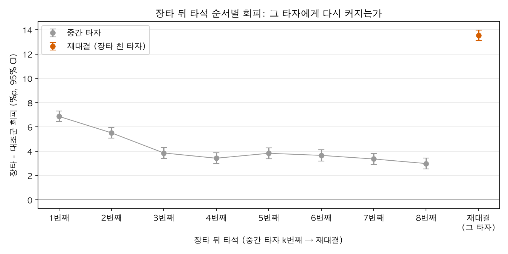

- 장타 직후 다음 타자에게는 6.9%p, 두 번째 5.5%p, 세 번째부터는 3~4%p로 줄어듭니다.
- 그런데 장타를 친 타자가 다시 나오면 **13.5%p**로 뛰어오릅니다.
- 중간 타자 평균은 4.0%p [3.8, 4.2], 재대결은 13.5%p [13.0, 14.0]. 그 차이인 **타자 맞춤 회피는 9.5%p** [9.0, 10.0]입니다. 재대결 회피의 약 70%가 그 타자를 향한 것입니다.
- 여기서 재대결 값(13.5%p)이 대표 수치(14.3%p)와 조금 다른 것은 기준이 달라서입니다. 중간 타자와 공정하게 비교하려고 평소 구사율을 **타자 손(좌/우)별** 시즌 구사율로 바꿨습니다.
- 홈런 뒤(11.5%p)가 2·3루타 뒤(8.2%p)보다 크고, 패스트볼·브레이킹·오프스피드 모두에서 나타납니다.

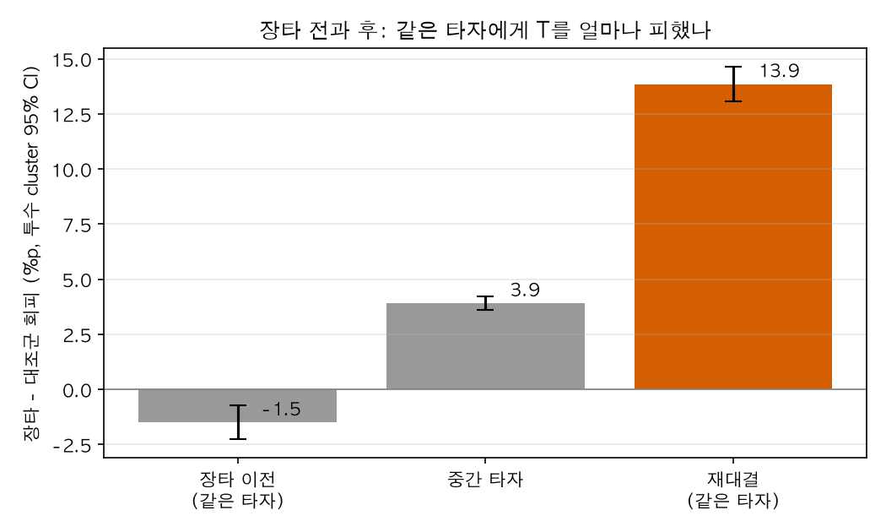

**"원래 강타자라 피한 것"도 아닙니다.** 장타 전에 같은 경기에서 그 타자를 상대한 경우(약 3분의 1)를 보면, 장타 **이전**에는 오히려 그 구종을 평소보다 더 던지고 있었습니다(−1.5%p). 장타가 기점입니다. (이 그림의 재대결 값 13.9%p는 이 3분의 1 이벤트만으로 계산한 값입니다.)

### 4-6. 결과와 타구 질 모두에 반응한다

장타는 대부분 잘 맞은 타구라서, 투수가 "장타"라는 결과에 반응하는지 "잘 맞았다"는 타구 질에 반응하는지 섞여 있습니다. 타구가 나온 모든 타석(아웃·단타·2·3루타·홈런)을 타구 질(xwOBA, 기대 득점 가치) 4분위로 나누고, **약하게 맞은 아웃**(투수가 결과와 타구 질 모두에서 이긴 경우)과 비교했습니다.

> ⚠️ **이 절의 숫자는 앞 절과 기준이 다릅니다.** 앞 절은 "비슷한 상황의 아웃 전체"와 비교한 순수 감소이고, 이 절은 "약하게 맞은 아웃"과 비교한 값입니다(배럴 그림은 "비배럴 아웃"과 비교). 아웃 전체에는 잘 맞은 아웃도 섞여 있어 기준이 더 높으므로, 이 절의 숫자(예: 홈런 +19.0%p)를 14.3%p와 직접 비교하면 안 됩니다. 이 절에서는 칸끼리의 **순서와 차이**를 보세요.

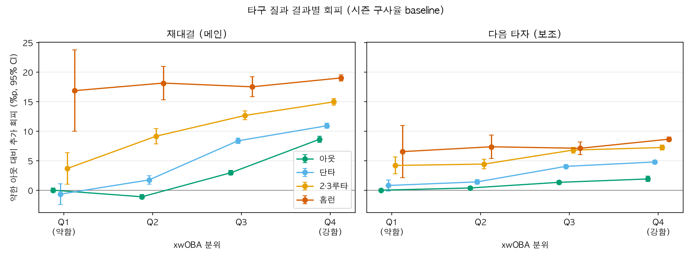

| 재대결, 약한 아웃 대비 추가 회피 | 타구 질 하위 25% | 상위 25% |
|---|---:|---:|
| 아웃 | 0 (기준) | **+8.6%p** [8.0, 9.2] |
| 단타 | −0.7 | +10.9 |
| 2·3루타 | +3.7 | +15.0 |
| 홈런 | +16.9 | +19.0 |

- **결과가 좋아도 잘 맞았으면 피합니다.** 잘 맞은 아웃은 약한 아웃보다 8.6%p, 배럴(이상적인 속도·각도의 타구) 아웃은 비배럴 아웃보다 10.1%p 더 피합니다.
- **타구 질이 같아도 결과가 나쁠수록 더 피합니다.** 같은 상위 25% 안에서 아웃 8.6 < 단타 10.9 < 2·3루타 15.0 < 홈런 19.0%p. 상황을 통제한 회귀에서도 타구 질을 고정했을 때 홈런은 아웃보다 18.9%p 더 피합니다.
- **홈런은 타구 질과 거의 무관합니다.** 홈런은 어느 분위에서나 17~19%p로 평평합니다. 홈런을 맞으면 타구가 어땠든 결과에 반응합니다. (다만 약한 홈런은 표본이 작아 천장 효과일 수 있습니다.)
- 다음 타자에서도 같은 모양이지만 크기는 절반 이하입니다.

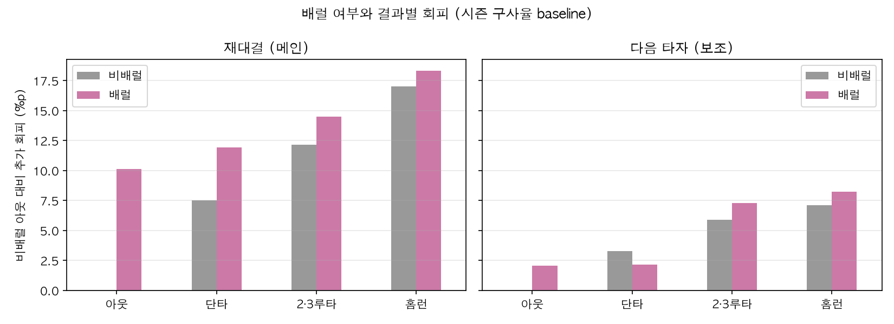

### 4-7. 그날 그 구종이 나빠서 피한 것이 아니다

장타는 실투나 그날 구위가 떨어진 공에서 더 자주 나옵니다. 그렇다면 장타와 회피가 둘 다 "그날 그 구종이 안 좋다"는 같은 원인에서 나왔을 수 있습니다. 장타 **이전**에 같은 경기에서 던진 그 구종의 구속, 헛스윙률, 피타구 질(각각 시즌 평균 대비)과 장타를 맞은 **그 공 자체**의 위치·구속을 통제했습니다.

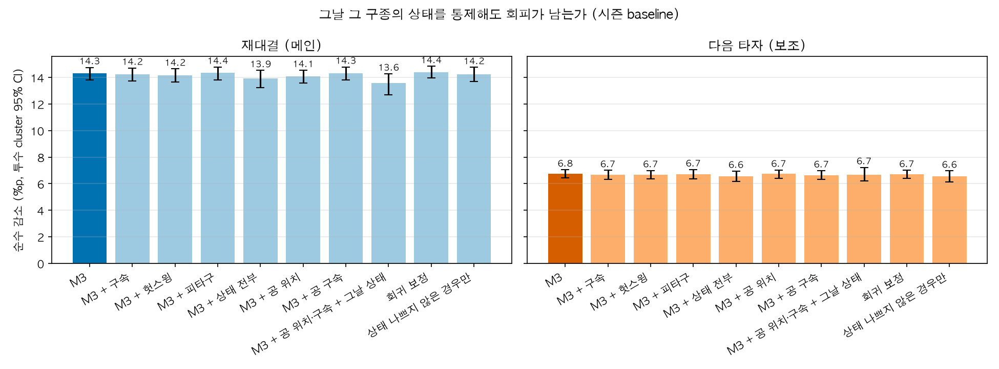

| 재대결, 통제한 것 | 순수 감소 | 장타 유지율 |
|---|---:|---:|
| M3 (기준) | 14.31%p [13.83, 14.76] | 98% |
| + 그날 구종 상태 3가지 | 13.92%p | 76% |
| + 공 위치·구속 + 그날 상태 | **13.57%p** [12.71, 14.28] | 52% |
| 그날 상태를 연속 변수로 넣은 회귀 | 14.40%p | 100% |
| 그날 상태가 나쁘지 않았던 경우만 | 14.23%p | 50% |

- 장타 이전의 그날 상태는 장타군과 대조군이 거의 같았습니다(SMD 0.03 이하).
- 장타를 맞은 공은 실제로 한가운데가 더 많았지만(58% vs 45%), 위치를 맞춰도 14.09%p로 거의 그대로입니다.
- 모두 통제해도 회피는 최대 약 5%만 줄어듭니다. 그날 구종이 나빴다면 중간 타자에게도 비슷하게 피했어야 하는데, 회피는 그 타자에게 집중됩니다(4-5절).

### 4-8. 같은 구종을 다시 던질 때 코스·구속을 바꾸는가

재대결에서 T를 다시 던진 경우(장타 12,459건, 대조군 18,579건)만 보면, 대조군 대비 변화는 코스 +0.02ft(약 0.25인치), 무브먼트·구속은 유의한 변화가 없거나 불안정했습니다. **투수는 같은 공을 다르게 던지기보다, 그 공 자체를 덜 던지는 방식으로 반응합니다.** (2026-09-25 분석, [분석결과_상세.md](분석결과_상세.md))

### 4-9. 신뢰구간을 제대로 냈나

처음에는 대조군을 무작위로 1:1 한 번만 뽑고, 모든 이벤트를 서로 독립으로 가정해 신뢰구간을 냈습니다. 두 가지 모두 문제가 될 수 있어 다시 계산했습니다.

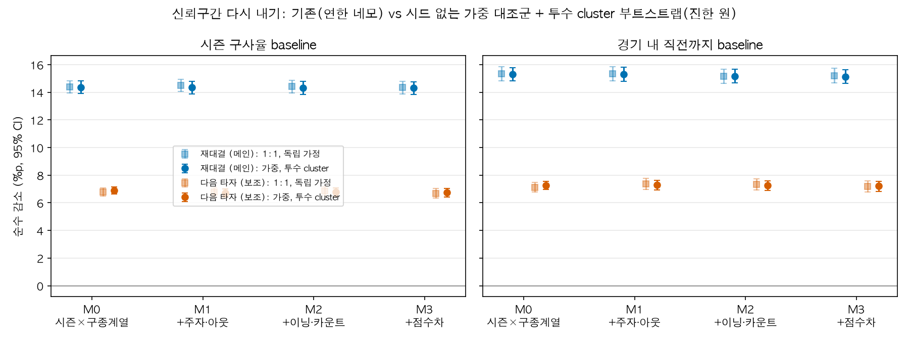

- **투수로 묶으면 신뢰구간이 1.15~1.23배 넓어집니다.** 같은 투수의 이벤트끼리 비슷하기 때문입니다.
- **대조군을 전부 쓰면 그만큼 좁아집니다.** 1:1 추출은 쓸 수 있는 아웃의 약 5분의 1만 썼습니다. 결과적으로 최종 신뢰구간 폭은 기존과 비슷하고, 결론은 바뀌지 않습니다.
- **무작위 추출의 시드만 바꿔도 값이 0.16%p(표준편차) 움직였습니다.** 오즈비도 0.28~0.30 사이로 움직여서, 이전에 보고된 0.286과 0.304의 차이는 데이터 차이가 아니라 추출 차이였습니다. 이 보고서의 수치는 시드가 필요 없는 가중 방식 기준입니다.

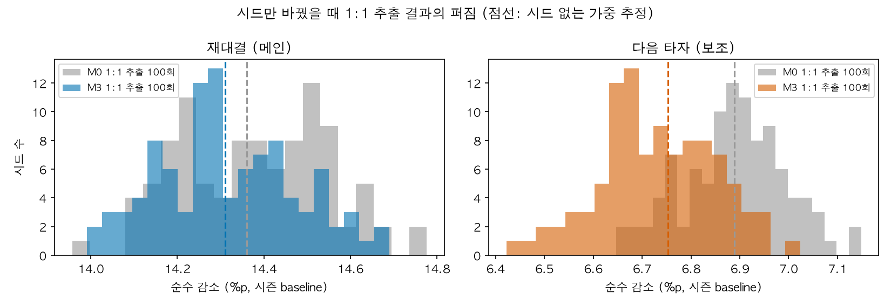

---

## 5. 종합 해석

1. **회피는 실재하고 큽니다.** 장타를 맞은 구종을 그 타자와의 재대결에서 약 14%p, 평소 구사율의 절반 가까이 덜 던집니다. 측정 단위가 달라 그대로 비교할 수는 없지만, 투구 단위의 일반적인 반복 회피(Kovash & Levitt, 직전 공이 패스트볼일 때 4.1%p)보다 훨씬 큰 규모입니다.
2. **경기 상황 때문이 아닙니다.** 주자·아웃·이닝·카운트·점수차를 맞춰도 그대로입니다.
3. **그날 구종 상태 때문도 아닙니다.** 장타 이전의 구위와 장타 맞은 공의 실투 여부를 맞춰도 거의 그대로입니다.
4. **그 타자를 향합니다.** 장타 직후 그 구종 전반을 잠시 덜 쓰는 경향(3~7%p)도 있지만, 회피의 대부분은 장타를 친 타자에게 집중됩니다. 장타 전에는 오히려 그 타자에게 그 구종을 더 던졌습니다.
5. **결과와 정보 모두에 반응합니다.** 잘 맞은 아웃도 피한다는 점은 타구 질이라는 정보에 반응한다는 뜻이고, 같은 타구 질에서 결과가 나쁠수록 더 피한다는 점은 결과 자체에도 반응한다는 뜻입니다. 홈런은 거의 결과에만 반응합니다.

따라서 이 회피는 **"장타를 친 그 타자에게, 맞은 그 구종을 덜 던지는" 타자 맞춤형 반응**으로 보는 것이 데이터와 가장 잘 맞습니다. 이것이 합리적 조정인지 과잉반응인지는 다음 단계의 질문입니다.

---

## 6. 한계

- **선발 투수 위주입니다.** 재대결은 타순이 한 바퀴 돌 때까지 던진 투수에게만 생기므로, 결과는 주로 선발 투수에 해당합니다. 표본에서 시즌 투구 수가 적은 투수도 빠져 있습니다.
- **"투수의 회피"가 아니라 "배터리의 회피"입니다.** 구종은 포수와 벤치가 함께 고르고, 데이터에 포수 정보가 없어 누구의 결정인지 나눌 수 없습니다.
- **관측하지 않은 요인이 남습니다.** 경기 중요도(레버리지), 투수의 피로·압박, 무브먼트·회전수 같은 다른 구위 지표, 손 감각은 통제하지 못했습니다.
- **측정 단위의 한계가 있습니다.** 타석의 약 4분의 1은 투구가 1~2개뿐이라 비율이 극단값이 되기 쉽고, 볼카운트 흐름의 영향을 받습니다(향후 분석: 초구 확인).
- **비슷한 구종으로 바꾼 것도 회피로 잡힙니다.** 구종 코드가 정확히 같을 때만 같은 구종으로 셉니다. 슬라이더 대신 스위퍼를 던져도 회피로 잡힙니다(향후 분석: 구종 이동 확인).
- **시즌 구사율에는 그 경기 이후 경기도 들어갑니다.** 그래서 경기 내 구사율 기준 결과를 함께 제시했고, 두 기준의 결론이 같습니다.
- **홈런의 "타구 질 무관" 결론은 조심해서 읽어야 합니다.** 약하게 맞은 홈런은 표본이 작습니다(재대결 기준 하위 25%에 37건).
- **한가운데 판정은 근사입니다.** 타자별 스트라이크 존 높이가 데이터에 없어 고정 범위로 판정했습니다.

---

## 7. 다음 단계

| 우선순위 | 내용 |
|---|---|
| 핵심 | **회피는 좋은 선택이었나.** 투구별 Run Value를 만들고(데이터의 주자·아웃·점수 변화로 기대득점표 계산), 재대결에서 T를 던졌을 때와 피했을 때의 결과를 비교. 이후 GBM으로 투수의 실제 선택이 합리적이었는지 평가 |
| 핵심 | **회피 성향 상·하위 투수 사례.** 투수별 회피율을 구해 많이 피하는 투수와 적게 피하는 투수의 성과 비교 |
| 보완 | **초구 확인:** 초구만 보거나 볼카운트를 통제해 측정 단위 확인 / **구종 이동 확인:** 줄어든 구종이 어디로 옮겨 갔는지 / **다음 타자 재정의:** 다음 타자를 "그 투수가 다음에 상대한 타석"으로 정의해 2아웃 장타 포함 |

---

## 부록 A. 초기 분석과 시행착오

처음 분석(2026-09-27~28)은 장타 뒤와 아웃·삼진·단타 뒤에 그 구종을 얼마나 던졌는지를 그대로 비교했습니다. 장타군 18.6% 대 대조군 31.7%(−13.1%p)라는 결과가 나왔지만, 다음과 같은 문제가 있어 방식을 바꿨습니다. 자세한 내용은 [archive/01_초기분석/](../archive/01_초기분석/README.md)에 보관했습니다.

| 문제 | 바꾼 방식 |
|---|---|
| 대조군에 아웃·삼진·단타를 모두 넣음. 삼진의 마지막 공은 2스트라이크 결정구이고 단타는 그 자체로 나쁜 결과라 장타와 비교하기에 성격이 다름 | 대조군을 `field_out`(타구가 나왔지만 아웃)으로 한정 |
| 투수가 원래 그 구종을 얼마나 던지는지를 빼지 않고 수준만 비교. 두 집단의 구종 구성이 달라(T가 포심인 비율 장타 36% vs 대조군 31%) 차이가 섞일 수 있음 | 평소 구사율 대비 변화의 차이(diff-in-diff) |
| 시즌·구종 분포를 맞추지 않음 | 시즌 × 구종계열 층화 |
| 경기 상황을 통제하지 않음 | 상황 매칭 사다리 M0 → M3 |
| 경기 전후 비교에서 "전" 구간에 항상 장타 공(T)이 들어가 대조군도 같이 떨어짐 | 사용하지 않음 |

결과의 방향(장타 뒤 덜 던짐)은 같았지만, 설계가 이를 보장하지 않았습니다. 새 방식으로 같은 결론이 나온 것은, 초기 결과가 우연히 맞았던 것이지 근거가 충분했던 것은 아니라는 점에서 의미가 있습니다.

---

## 부록 B. 수치 기준과 재현

**수치 기준.** 이 보고서의 순수 감소와 신뢰구간은 노트북 06·07의 **가중 대조군 + 투수 cluster 부트스트랩** 값입니다. 오즈비는 노트북 03의 1:1 표본 값이고, 시드에 따른 퍼짐(±0.01)은 노트북 06에 있습니다. 4-3절과 4-8절은 이전 분석(원본 데이터 파이프라인) 값입니다.

| 노트북 | 내용 | 보고서 절 |
|---|---|---|
| `03_CY_matching_ladder_by_mode` | M0~M3 매칭, 재대결·다음 타자, 오즈비 | 4-1, 4-2, 4-4 |
| `04_CY_hit_quality_avoidance` | 결과 × 타구 질 | 4-6 |
| `05_CY_batter_specific_avoidance` | 중간 타자 vs 재대결, 장타 전후 | 4-5 |
| `06_CY_robust_inference` | 가중 대조군, 투수 cluster CI, 시드 퍼짐 | 4-2, 4-9 |
| `07_CY_pitch_state_control` | 그날 구종 상태, 장타 맞은 공 | 4-7 |

**재현.** 데이터 준비와 실행 명령은 [README](../README.md)의 '분석 재현 순서'를 보세요. 보고서 그림은 노트북을 실행한 뒤 `python -m src.visualization.report_figures`로 `docs/figures/`에 만듭니다.

---

## 부록 C. 용어집

| 용어 | 뜻 |
|---|---|
| 장타 (XBH) | 2루타, 3루타, 홈런 |
| %p | 비율의 차이(퍼센트포인트). 30%에서 20%로 줄면 −10%p |
| 차이의 차이 (diff-in-diff) | 장타군의 변화에서 대조군의 변화를 빼는 방법. 결과와 상관없이 생기는 변화를 걷어냄 |
| SMD | 표준화 평균차. 두 집단의 평균 차이를 표준편차로 나눈 값. 0.1 미만이면 비슷하다고 봄 |
| 오즈비 | 어떤 일이 일어날 오즈의 비. 0.29면 대조군보다 오즈가 약 30% 수준 |
| 95% CI | 95% 신뢰구간. 이 구간이 0을 포함하지 않으면 효과가 통계적으로 뚜렷함 |
| 부트스트랩 | 표본을 복원 추출해 다시 계산하기를 반복해 불확실성을 재는 방법 |
| xwOBA | 타구 속도와 각도로 계산한 기대 득점 가치. 높을수록 잘 맞은 타구 |
| 배럴 | 장타가 되기 쉬운 이상적인 속도·각도 조합의 타구 |
| 구종계열 | 패스트볼(포심·싱커·커터), 브레이킹(슬라이더·스위퍼·커브), 오프스피드(체인지업·스플리터) |
