# 장타를 맞은 투수는 그 구종을 피하는가

**그리고 그 회피는 좋은 선택이었나**

YSAL 9기 · 야구 2팀 1차 프로젝트 · 최종 정리 (11쪽 요약판)

MLB Statcast 2021 ~ 2026-07-12 · 투구 3,592,302개 · 투수 1,067명 · 곽동윤 · 김민정 · 김찬영 · 이범석 · 이인규

> 이 문서는 발표용 11쪽 요약판을 쪽 순서대로 옮긴 것입니다. 5쪽 뒤에는 이전 판 5쪽의 구종 분포 원 그림을 덧붙였습니다.
> 수치를 다시 계산하는 방법은 저장소 루트의 `main.py`와 [재현 결과](재현결과.md)를 보세요.

---

## 1. 한눈에 보는 결론

| 질문 | 답 | 핵심 수치 |
|---|---|---|
| 장타 친 타자를 같은 경기에서 다시 만나면 맞은 구종을 덜 던지나? | **예** | 비슷한 상황의 아웃 뒤보다 **14.3%p** 덜 던짐, 다시 던질 오즈 **0.29배** |
| 경기 상황 때문 아닌가? | **아니다** | 주자·아웃·이닝·카운트·점수차를 맞춰도 14.3%p 그대로 |
| 누구를 향한 회피인가? | **그 타자** | 회피의 약 70%(9.5%p)가 장타를 친 그 타자에게 집중 |
| 어떤 장타일 때 더 피하나? | **홈런·강한 타구** | 홈런 여부 > 점수차 > 타구속도 순으로 영향, 볼카운트·주자는 작음 |
| 회피는 좋은 선택이었나? | **확정 못 함** | 모델 점수상 회피군이 약간 높지만(+0.0023) 득점 이득으로 볼 수 없고, 구사율별 유불리는 재검증에서 유지되지 않음 |

> **한 문장 결론.** 투수는 장타를 맞은 구종을 그 타자에게 확실히 덜 던진다. 그러나 현재 자료와 검증 결과만으로는 이 회피의 **성과상 이점을 확정하기 어렵다.**

### 발표 흐름 (10/5 회의 결정)

| ① 회피 확인 | ② 회피 요인 | ③ 회피 효과 평가 | ④ 사례·결론 |
|---|---|---|---|
| p.3–5 | p.6–7 | p.8–10 | p.11 |

출처: Chanyoung 브랜치(노트북 03–07) · DongYun22 fork Dongyun 브랜치(노트북 01–11) · Beomseok 브랜치(GBM_analysis.md)

---

## 2. 문제 정의 · 데이터 · 측정 방법

### "방금 슬라이더 맞았으니 다음엔 안 던지겠죠"

선행연구는 한 타석 안의 조정(Gmeiner 2019)이나 결과와 무관한 배합 변화(Roegele 2013)를 다뤘다. **장타라는 결과 뒤 → 타석 사이에서 → 같은 타자에게** 구종이 바뀌는지는 비어 있었다.

| 데이터 | 내용 |
|---|---|
| 출처·기간 | MLB Statcast 투구 단위, 2021 ~ 2026-07-12 정규시즌, 시즌 500구 이상 투수(2026은 300구) |
| 분석 대상 | 장타 70,319건 중, 같은 경기에서 같은 투수가 그 타자를 다시 상대한 **재대결 27,391건** |
| 구종 T | 장타(또는 대조군 아웃)를 맞은 공의 구종 |

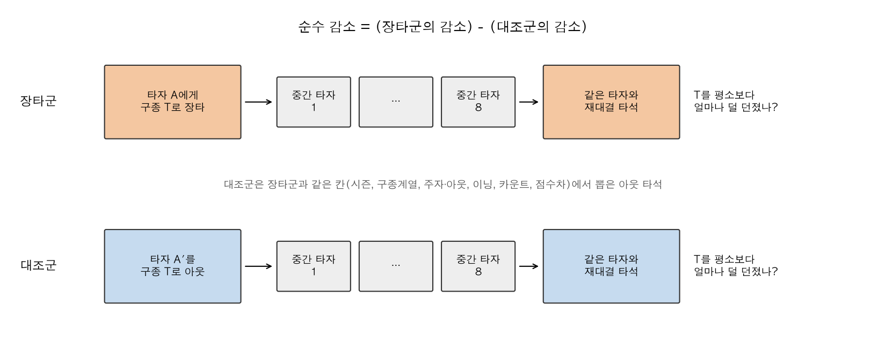

**대조군과 순수 감소**

- 같은 경기에서 이미 던진 구종은 원래 다시 던지는 경향이 있어 비교군이 필요
- 대조군 = 범타(field_out): 공이 맞은 건 같고 결과만 좋음
- **순수 감소** = 장타군의 (평소 구사율 − 재대결 비율) − 대조군의 같은 값

**상황 맞추기 사다리**

| 단계 | 대조군을 맞추는 조건 |
|---|---|
| M0 | 시즌 × 구종계열 |
| M1 | + 주자 × 아웃 |
| M2 | + 이닝 + 볼카운트 |
| M3 | + 점수차 |

신뢰구간은 투수 단위 cluster 부트스트랩, 오즈비는 투수 랜덤효과를 넣은 혼합효과 로지스틱 회귀(R lme4).

출처: Chanyoung 보고서 1–3장 · 동윤 노트북 01 · 0928 회의록

---

## 3. ① 회피 확인 — 장타 맞은 구종을 그 타자에게 덜 던진다

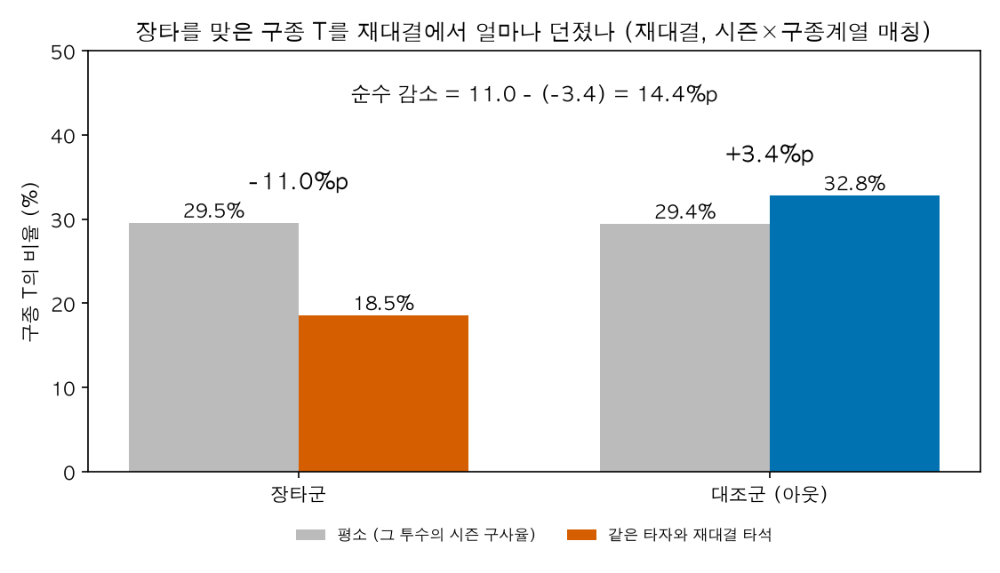

| 14.3%p | 0.29 | 6.75%p |
|---|---|---|
| 순수 감소 (M3) [13.8, 14.8] | 다시 던질 오즈비 [0.27, 0.31] | 바로 다음 타자 (보조) |
| 평소 구사율의 약 절반 | | 재대결의 절반 이하 |

### 경기 상황을 맞춰도 그대로

| 재대결 | M0 | M1 | M2 | M3 |
|---|---|---|---|---|
| 순수 감소 (%p) | 14.36 | 14.36 | 14.32 | **14.31** |
| 다시 던질 오즈비 | 0.30 | 0.28 | 0.29 | **0.29** |

- 장타는 주자가 있을 때 더 자주 나왔지만(SMD 0.12), 맞춰도 값이 신뢰구간 안에서 움직이지 않음
- 평소 그 구종 의존도가 높을수록 덜 피함 → 대체 구종이 없으면 피하기 어렵다
- 6개 시즌, 9개 구종 모두에서 같은 방향

출처: Chanyoung 노트북 03·06 · 동윤 노트북 01 (교차확인)

---

## 4. ① 회피 확인 — 그 타자를 향하고, 다시 던질 땐 낮게 던진다

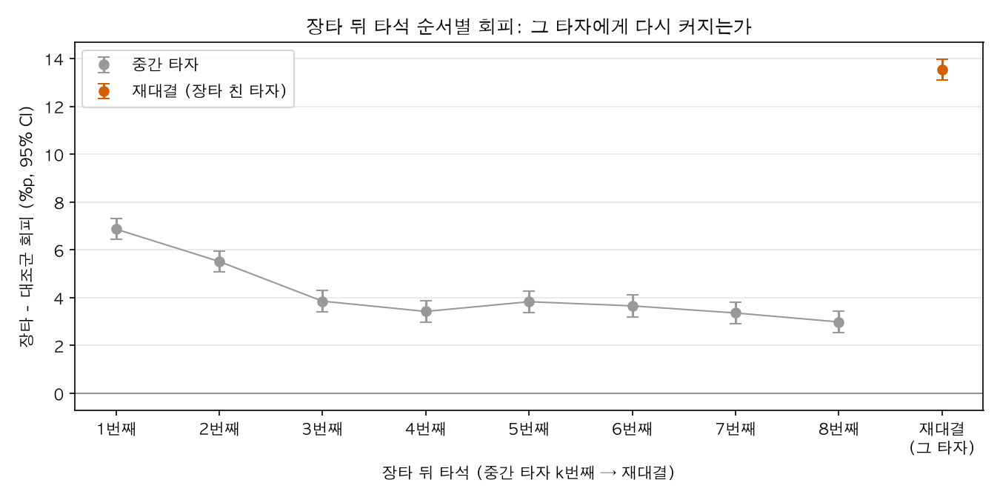

| 대조군 대비 추가 회피 | %p [95% CI] |
|---|---|
| 재대결 전에 상대한 중간 타자 평균 | 4.0 [3.8, 4.2] |
| 재대결 (장타 친 그 타자) | 13.5 [13.0, 14.0] |
| **타자 맞춤 회피** | **9.5 [9.0, 10.0] → 약 70%** |

장타 전에는 그 타자에게 오히려 T를 1.5%p 더 던졌다 → "원래 강타자라 피한 것"이 아니다.

### 그래도 다시 던진다면, 변화구는 더 낮게

T를 다시 던진 재대결만 골라 장타 후 vs 범타 후(M3 매칭)를 그 투수 평소 대비 편차로 비교

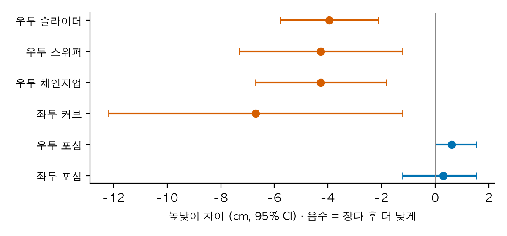

| 구종 | 장타 후 재대결 − 범타 후 재대결 |
|---|---|
| 우투 슬라이더·스위퍼 | 더 낮게(약 4cm), 더 바깥(글러브 쪽)으로 |
| 우투 체인지업 · 좌투 커브 | 더 낮게 (4~7cm) |
| 포심·싱커·커터 | 차이 없음 · 구속·무브먼트도 대부분 차이 없음 |

구종별 전체 그림은 다음 쪽. 크기가 작고 다중비교·투수 군집 보정 없음. 다시 던진 비율이 장타 45.7% vs 대조군 67.7%로 달라 선택 문제가 남는다.

출처: Chanyoung 노트북 05(타자 맞춤) · 동윤 노트북 02 (5–6절, 10/6 대조군 추가판)

---

## 5. ① 회피 확인 · 다시 던질 때 (구종별 전체) — 재대결에서 같은 구종은 어떻게 달라졌나

T를 다시 던진 재대결 타석에서, 그 투수의 평소(같은 시즌·같은 구종·같은 손 타자) 대비 편차를 **장타 후 재대결(채운 주황)** 과 **범타 후 재대결(빈 파랑, M3 매칭 대조군)** 으로 나란히 그렸다. 0 = 평소와 같음, 두 점 사이 간격이 장타의 효과.

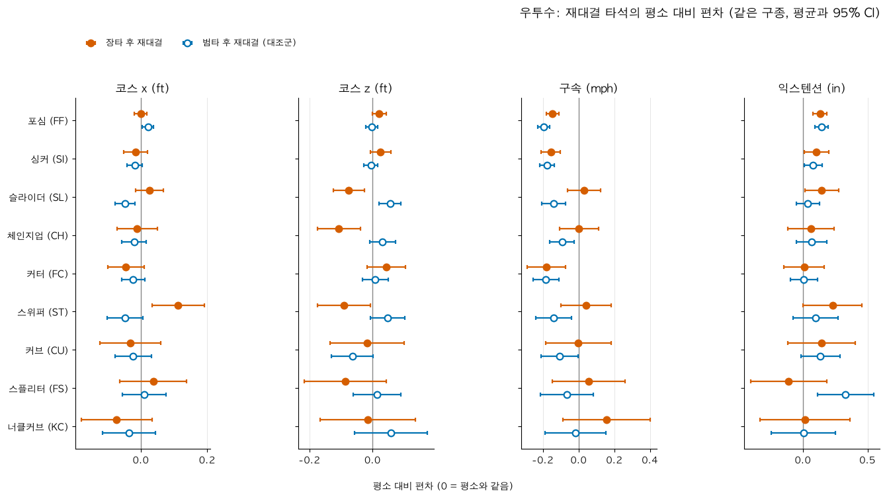

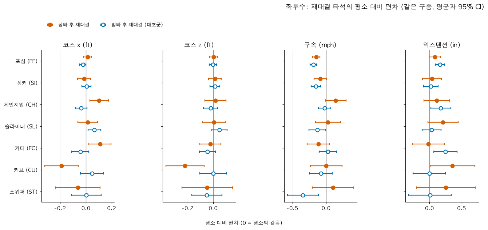

- **코스 z(높낮이):** 우투 슬라이더·체인지업·스위퍼와 좌투 커브는 장타 후 점이 0보다 아래, 대조군은 0 근처나 위 → 장타 뒤에만 낮게 던진다
- **코스 x(좌우):** 우투 스위퍼는 글러브 쪽(+), 좌투 체인지업은 팔 쪽, 좌투 커브는 글러브 쪽으로 이동
- **패스트볼(포심·싱커·커터):** 두 점이 거의 겹친다. 구속은 두 집단 모두 평소보다 조금 느리고, 익스텐션은 대부분 차이 없음

CI는 정규근사이며 투수 군집·다중비교 보정 없음. 112개 비교 중 16개가 구별됨(차이가 없어도 우연히 약 6개). 한 구종 한 지표에서만 나온 차이는 해석하지 않음.

출처: 동윤 노트북 02 (5절 대조군 비교 그림, 위 우투수 · 아래 좌투수)

### 5-1. (원 그림) 장타 타석과 재대결 타석의 구종 분포

장타를 맞은 타석(주황)과 같은 타자와의 재대결 타석(파랑)에서 던진 같은 구종을 투수 손별로 겹쳐 그렸다. 행 = 구종, 열 = 코스 · 무브먼트 · 구속.

  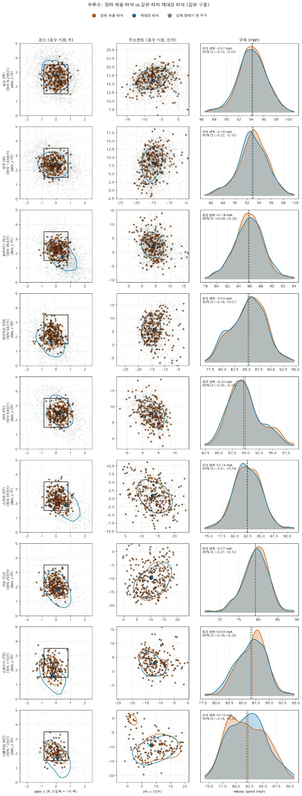
  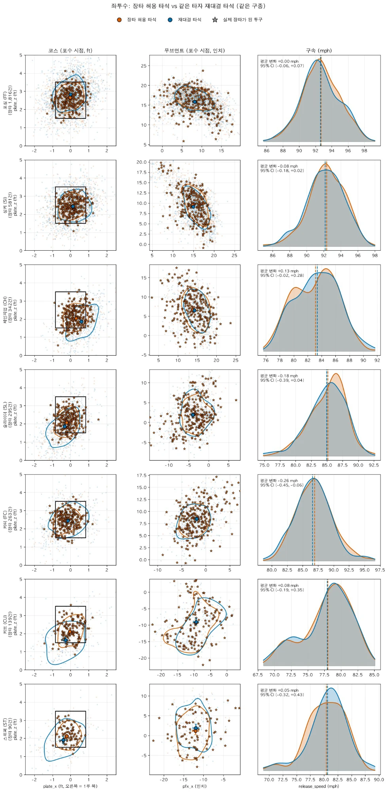

- **읽는 법:** ★ = 실제 장타가 된 공, 등고선 = 투구가 몰린 영역(50%), 큰 점 = 평균. 사각형은 고정 스트라이크 존(타자별 존 높이는 데이터에 없음)
- **눈에 띄는 것:** 슬라이더·스위퍼·체인지업·커브는 파란 등고선이 존 아래·바깥으로 내려간다. 무브먼트와 구속 분포는 거의 겹친다
- **주의:** 대조군 없는 비교라 장타 공 자체(몰린 실투)가 출발점에 섞여 있다. 그래서 p.4에서 범타 후 재대결과 비교했고, 변화구가 낮아지는 것만 남았다. 이 그림에서 보이는 포심이 높아지는 변화는 대조군과 비교하면 사라진다

출처: 동윤 노트북 02 (1–4절 그림, 왼쪽 우투수 · 오른쪽 좌투수)

---

## 6. ② 회피 요인 · 타구 질 — 결과와 타구 질, 둘 다에 반응한다

모든 타구를 결과 × 타구 질(xwOBA 4분위)로 나눠 "약하게 맞은 아웃"과 비교했다.

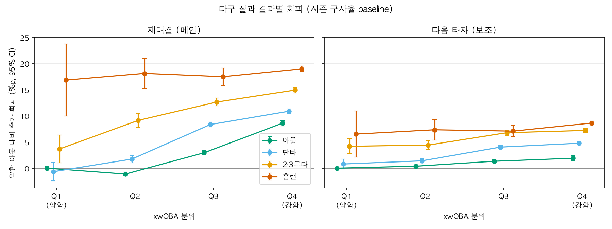

| 재대결, 약한 아웃 대비 추가 회피 | 타구 질 하위 25% | 상위 25% |
|---|---|---|
| 아웃 | 0 (기준) | +8.6 |
| 단타 | −0.7 | +10.9 |
| 2·3루타 | +3.7 | +15.0 |
| 홈런 | +16.9 | +19.0 |

- **타구 질에 반응:** 잘 맞은 아웃도 피한다 (배럴 아웃은 비배럴 아웃보다 +10.1%p)
- **결과에 반응:** 타구 질이 같아도 아웃 < 단타 < 2·3루타 < 홈런 순으로 더 피한다
- **홈런은 타구 질과 거의 무관** — 장타에서는 타구 질보다 결과에 더 민감
- 기준이 "약한 아웃"이라 14.3%p와 직접 비교하지 않는다. 약한 홈런은 37건뿐.

출처: Chanyoung 노트북 04 · 이범석 Beomseok README (타구질 분석)

---

## 7. ② 회피 요인 · 상황 변수 — 홈런·접전·빠른 타구일수록 더 피한다

장타 이벤트별 구종 사용 변화를 GBM으로 예측하고 SHAP으로 변수별 영향을 봤다.

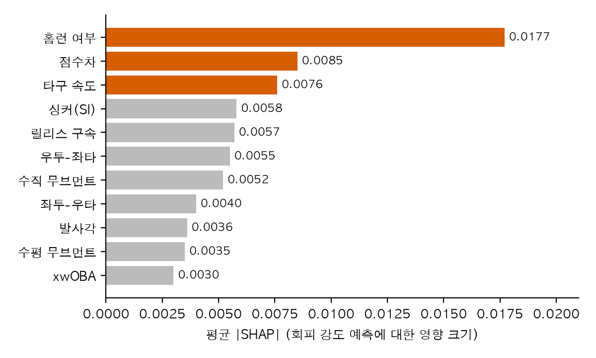

- 볼카운트·주자·아웃은 중요도 낮음 (상황 매칭 결과와 일치)
- **R² 0.035** — 현재 변수로 개별 회피 강도를 예측하는 능력은 제한적이다. SHAP은 모델이 많이 참고한 변수를 보여 줄 뿐 인과 효과가 아니다. 이 분석은 "같은 시즌 내 재대결"(38,012건) 기준.

| 변수 | 방향 |
|---|---|
| 홈런 여부 (1위) | 홈런이면 회피 강화 — 2·3루타보다 더 피함 |
| 점수차 (2위) | 비선형: 접전일 때 회피 강화, 점수차가 크면 약화 |
| 타구 속도 (3위) | 빠를수록 회피 강화 |

출처: Beomseok GBM_analysis.md (HistGradientBoosting + SHAP)

---

## 8. ③ 회피 효과 평가 — 회피는 좋은 선택이었나: 어떻게 쟀나

GBM은 작은 의사결정나무를 차례로 학습해 이전 예측의 오차를 보완하는 방법이다. 같은 알고리즘이라도 **학습 타깃이 다르면 다른 모델**이다. 이 프로젝트는 GBM을 두 가지 목적으로 썼다.

| 목적 | 학습 타깃 | R² |
|---|---|---|
| 회피 요인 (p.7) | 장타 후 구종 사용 변화 → SHAP으로 모델이 많이 참고한 변수 확인 (범석) | 0.035 |
| 회피 효과 (p.9–10) | 결정구의 wOBA (볼카운트·아웃·주자·점수차·좌우·구종·구사율, 투수 ID 제외, 2021–25 학습 → 2026 검증) (동윤 09·11) | 0.057 |
| 별도 시도 | 카운트 기반 Run Value (동윤 06) | 0.0007 |

> **R² 읽는 법.** R² = 1 − (모델의 제곱오차 합 ÷ 평균만 예측했을 때의 제곱오차 합). 평균 예측의 오차를 100으로 놓으면 세 모델은 96.5 / 94.3 / 99.93이다. 0.057은 "정확도 5.7%"가 아니라 제곱오차를 5.7% 줄였다는 뜻이다. 남은 오차에는 결과의 변동성, 누락된 정보, 모델이 놓친 관계가 섞여 있어 전부 운으로 볼 수 없다. 타깃과 표본이 달라 세 R²로 모델의 우열을 가리기도 어렵다.

### 시도한 지표와 결과

| 노트북 | 지표 | 결과 |
|---|---|---|
| 03 · 04 | 실제 − 기대(RVAE), 회피형 vs 승부형 투수 | 비유의 (p=0.063 / 0.067) |
| 05 | 모델 최선과 실제 선택 일치율 | 33.4% (무작위 23.7%), 승부형이 더 높음 |
| 07 · 08 | 이벤트 단위 혼합효과 / 조건별 상호작용 | 비유의 (p=0.41, 0.78 / Holm p≥0.52) |
| 10 | 주무기(비패스트볼) 맞은 경우만 | 효과 사라짐 (p=0.47) |
| 09 | 선택점수 | 모델 점수상 회피군이 약간 높음 (p.9) |
| 11 | 선택점수 × 맞은 구종 구사율 | 기존 사양에서만 관찰, 재검증에서 유지 안 됨 (p.10) |

**RVAE(실제 결과 − 실제 구종의 예측값)는 잔차다.** 실행 능력뿐 아니라 누락된 정보·수비·우연·모델 오차가 함께 들어 있고, 기대값에 실제 구종이 들어가 구종 선택의 몫이 같이 지워진다.

**실제 값과 예측 값은 역할이 다르다.** Run Value·wOBA는 투구 결과가 나온 뒤 계산한 값이고, GBM은 던지기 전 정보로 그 상황의 평균 가치를 예측한다. 타깃이 계산된 값이라는 것 자체는 문제가 아니다. 06의 R² 0.0007은 "사용한 피처로 투구별 Run Value를 예측했을 때 평균 예측보다 거의 개선되지 않았다"는 뜻이다.

출처: Beomseok GBM_analysis.md · 동윤 노트북 03–11

---

## 9. ③ 회피 효과 평가 — 모델 점수로는 회피 쪽이 약간 높다

"그 구종을 고른 것"을 평가하려고, 같은 상황에서 구종만 바꿔 같은 GBM으로 두 번 예측했다.

> **선택점수 = 예측(장타 맞은 구종 재사용) − 예측(실제로 선택한 구종)**
>
> 양수 = 모델이 실제 구종을 재사용보다 유리하게 평가 · 구종을 바꿀 때 구사율 등 구종별 피처도 함께 바꿈

| 가상 예시 | 예측값 |
|---|---|
| 슬라이더(맞은 구종) 재사용 | 0.310 |
| 실제로 던진 체인지업 | 0.304 |
| **선택점수** | **+0.006** |

| +0.0023 | [0.0009, 0.0037] |
|---|---|
| 회피군 − 재사용군 평균 선택점수 | GBM 재학습 불확실성까지 반영한 보수적 95% CI (p ≈ 0.002) |
| 재대결 27,245건 · 투수 695명 | |

### 이 숫자를 읽을 때

- **모델 점수 차이이지, 실제로 절약한 득점이 아니다.** 타석 점수는 투구별 예측 차이의 평균이라 실제 타석 wOBA 개선이나 득점으로 바로 환산할 수 없다
- 평가 대상 투구의 실제 결과는 쓰지 않지만, 모델이 과거 결과로 학습됐으므로 학습 자료의 편향과 모델 오차는 점수에 남는다
- 순열검정(5,000회)과 공변량 시점 점검은 통과. GBM 50회 재학습의 흔들림이 표준오차의 2배 이상이라 정밀도는 처음 보고보다 낮다

출처: 동윤 노트북 09

---

## 10. ③ 회피 효과 평가 — 구사율별 차이는 재검증에서 유지되지 않았다

비패스트볼 구종으로 장타를 맞은 재대결에서, 맞은 구종의 평소 구사율에 따라 회피군 − 재사용군 선택점수 차이가 달라지는지 봤다. 기존 사양(아래 그림)에서는 구사율이 낮을수록 회피 쪽 점수가 높았다.

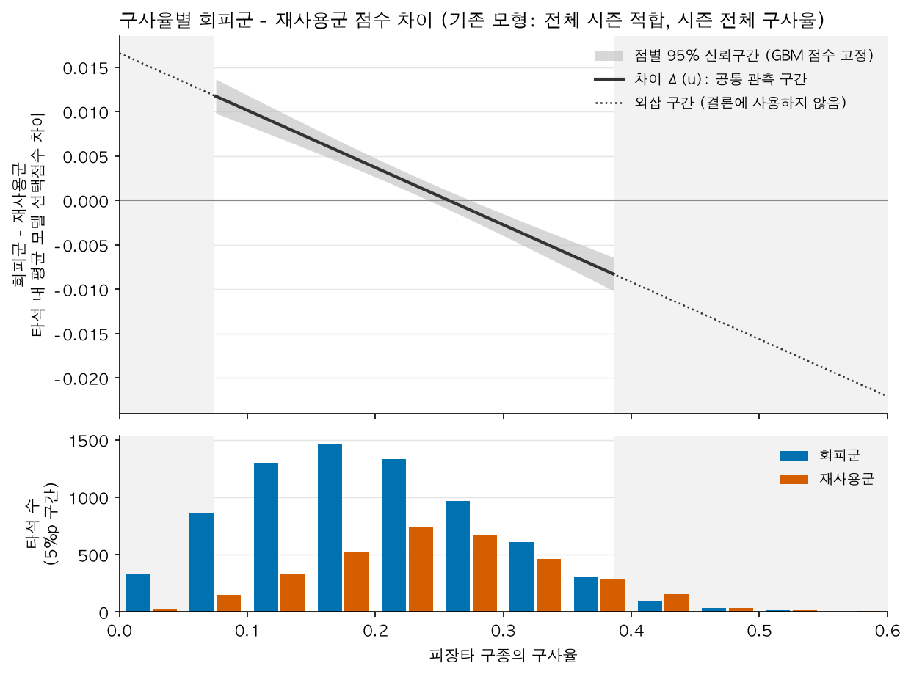

| 사양 | 건수 | 회피 × 구사율 계수 | 95% 구간 |
|---|---|---|---|
| 기존: 시즌 전체 구사율, 전체 시즌 학습 | 10,747 | −0.0645 | [−0.0749, −0.0541] GBM 고정 |
| 경기 전 구사율, 시간 외 합산 평가 | 8,813 | +0.0061 | [−0.0352, +0.0281] 전체 과정 부트스트랩 |
| 2021–25 학습 → 2026 평가 | 1,096 | −0.0283 | [−0.1061, +0.0113] 전체 과정 부트스트랩 |

- 같은 표본에서도 **구사율 정의를 바꾸면 계수가 크게 바뀌고**, GBM에서 구사율 입력을 빼면 부호가 반대(+0.0127)가 된다 → 기존 결론은 피처 정의에 민감했다
- 시즌 전체 구사율에는 재대결 이후 기록이 들어 있다. 당시 선택을 평가하려면 경기 전까지 알 수 있던 정보로 봐야 한다

> 신뢰구간이 0을 포함한다고 관계가 없다는 증명은 아니다. 또 비패스트볼만 본 11번 결과로 09번 전체 표본의 평균 차이까지 부정할 수는 없다. 정리하면: **기존 모형에서 구사율별 차이가 관찰됐지만, 경기 전 정보와 시간 외 평가에서는 안정적으로 확인되지 않았다.**

출처: 동윤 노트북 11 (4·6·7·8절)

---

## 11. ④ 사례 · 결론 · 한계 — 회피는 확실하다, 그 이점은 아직 확정할 수 없다

### 투수 사례

| 회피 상위 (회피율) | 회피 하위 (회피율) |
|---|---|
| Schultz 92% · Arihara 91% · Schwellenbach 83% · Crismatt 82% · Brieske 81% | Yesavage 10% · Widener 14% · McKenzie 15% · Abbott 17% · Sasaki 18% |

양쪽 모두 성과(RVAE)가 제각각 → 회피율만으로 투수를 가를 수 없다. 극단값은 대부분 표본이 작은 투수이고, 회피 성향의 투수 고유 몫은 약 1/4(ω² 0.27). 주력 구종·결정구·구종 가치를 보는 심화 사례 분석은 진행 전.

### 결론

- **회피는 있다:** 재대결에서 14.3%p, 경기 상황으로 설명되지 않고, 70%가 그 타자를 향한다
- **결과에 민감하다:** 홈런·접전·빠른 타구일수록 더 피하고, 다시 던질 땐 변화구를 낮게 던진다
- **효과는 확정하지 못했다:** 모델 점수상 회피군이 약간 높지만 득점 이득으로 볼 수 없고, 구사율별 유불리는 재검증에서 유지되지 않았다

> **최종 메시지.** 회피 행동은 관찰되었다. GBM으로 선택의 질을 평가하는 탐색을 진행했지만, 현재 자료와 검증 결과만으로 회피의 성과상 이점이나 구사율에 따른 유불리를 확정하기는 어렵다. GBM의 예측력 개선과 선택점수 비교의 타당성 검증을 함께 진행해야 한다.

### 한계

- **입력 정보:** 상황·구종·구사율만으로는 투수의 구종별 능력과 타자와의 상성을 구분하기 어렵다
- **비교의 가정:** 실제 던진 구종을 잘 예측해도, 같은 순간 다른 구종을 던졌을 때의 결과까지 맞힌다는 보장은 없다
- **학습·평가 단위:** 결정구로 학습한 모델을 모든 투구에 적용해 평균 냈다. 이 평균이 타석 전체 전략의 성과는 아니다
- **검증:** 낮은 R²만으로 집단 비교가 무효는 아니지만, 선택점수 차이의 방향·크기가 검증에서도 안정적인지는 따로 확인해야 한다. 알고리즘 교체나 R² 향상만으로 해결되지 않는다
- **표본·관측:** 재대결은 주로 선발 투수, 포수 정보 없음("배터리"의 결정), 레버리지·피로 미통제, 여러 지표 중 일부만 유의(다중비교)

출처: 동윤 노트북 03·07·09·11 · Chanyoung 보고서 6장
